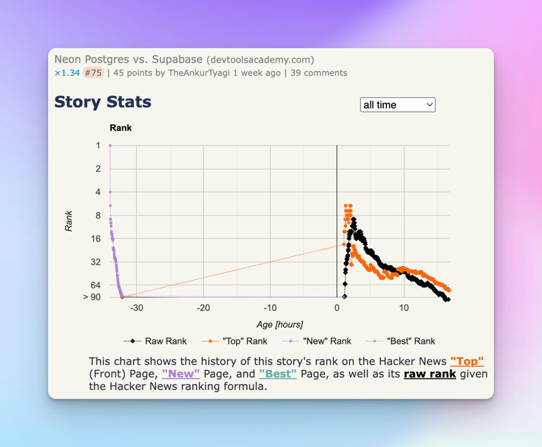

# Dev Tools Academy

DevToolsAcademy is an open source blog dedicated to awesome developer tools, frameworks, and technologies.
My mission is to help developers and founders make informed decisions about the developer tools they use in their daily workflow.

## 🌟 Featured on Hacker News and Hashnode

| Blog Post | Featured On | Description |
| --- | --- |  |
| [Neon Postgres vs. Supabase](https://www.devtoolsacademy.com/blog/neon-vs-supabase) | Hacker News | Made it to the second page of Hacker News.  |
| [Serverless Databases](https://www.devtoolsacademy.com/blog/state-of-databases-2024) | Hashnode | Featured on [Hashnode](https://theankurtyagi.hashnode.dev/serverless-databases) |
| [MongoDB vs. PostgreSQL](https://www.devtoolsacademy.com/blog/mongoDB-vs-postgreSQL) | DevTools Academy | What’s the Difference Between MongoDB and PostgreSQL? |

## 🚀 Quick Start

This project is built with [Next.js](https://nextjs.org/). To get started:

1. Clone the repository
2. Install dependencies: `npm install`
3. Run the development server: `npm run dev`
4. Open [http://localhost:3000](http://localhost:3000) in your browser

## 🤝 How to Contribute

I welcome contributions from developers of all skill levels. Here's how you can help:

1. **Submit a Blog Post**: Have experience with dev tools? Write a post and submit a pull request.
2. **Improve the Site**: Help me enhance the user experience or add new features.
3. **Spread the Word**: Share the articles in developer communities and invite others to contribute.

Check out the [CONTRIBUTING.md](CONTRIBUTING.md) for detailed guidelines.

## ✍️ Calling All Developers Who Cares About Writing and Developer Tools

Are you a person in tech looking to showcase your honest take on any developer tool? DevToolsAcademy offers a unique opportunity:

- **Showcase Your Expertise**: Write in-depth, comparative analyses of developer tools.
- **Gain Exposure**: Your articles will be promoted by me across Hacker News, Reddit, and our social media channels, reaching thousands of developers.
- **Make an Impact**: Help fellow developers and founders make informed decisions about the tools they use daily.

To get started, check our [CONTRIBUTING.md](CONTRIBUTING.md) file and reach out to us at <hello@theankurtyagi.com> with your ideas or draft outlines.

## 📝 Blog Post Guidelines

- Focus on comparing 2 developer tools at a time, not more than that.
- Provide objective analysis based on real-world usage.
- Include code examples and performance metrics when relevant.
- Aim for a length of 1500-2000 words.
- Build something and compare, don't just rely on docs and other blogs.

## 📈 Growth and Goals

I'm committed to continuous improvement. my short term goals include:
- Reach 100,000 monthly visits by the end of the year.

Join me in achieving this milestones.

## 📬 Contact

Have questions or suggestions? Open an issue or reach out to me at [hello@theankurtyagi.com](mailto:hello@theankurtyagi.com).

## 📄 License

This project is licensed under the Creative Commons License - see the [LICENSE](LICENSE) file for details.

---

Let's build the go-to resource for developer tool space, together 🚀