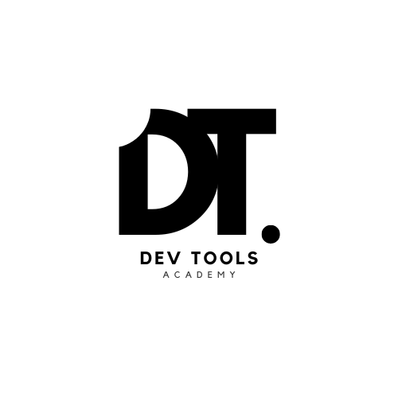

# Dev Tools Academy



## The Developer's Guide to Modern Developer Tools

> **Featured on Hacker News & Hashnode.**
> DevTools Academy is the premier open-source resource helping developers and technical founders navigate the complex landscape of modern development tools. We turn technical comparisons into actionable insights.

## 🏆 Featured Comparisons

| Comparison                                                                                                                  | Stats                        | Key Finding                                                      |
| --------------------------------------------------------------------------------------------------------------------------- | ---------------------------- | ---------------------------------------------------------------- |
| [Neon Postgres vs. Supabase](https://www.devtoolsacademy.com/blog/neon-vs-supabase)                                         | 📈 Front page on Hacker News | Unbiased and detailed comparisons between 2 serverless databases |
| [State of Databases 2024](https://www.devtoolsacademy.com/blog/state-of-databases-2024)                                     | 🌟 Featured on Hashnode      | Comprehensive analysis of serverless database options            |
| [Stream vs Twilio](https://www.devtoolsacademy.com/blog/stream-vs-twilio/)                                                  | 💬 Customer Support Focus    | Head-to-head comparison for building support bots                |
| [CodeRabbit vs Other AI Code Review Tools](https://www.devtoolsacademy.com/blog/coderabbit-vs-others-ai-code-review-tools/) | 🤖 AI Code Review            | In-depth analysis of generative AI code review solutions         |
| [MongoDB vs. PostgreSQL](https://www.devtoolsacademy.com/blog/mongoDB-vs-postgreSQL)                                        | 🔍 Technical deep dive       | Unbiased comparisons with code examples                          |
| [Supabase Auth vs. Clerk](https://www.devtoolsacademy.com/blog/supabase-vs-clerk)                                           | 🔐 Auth focused              | Unbiased comparisons with actual integration code                |

## Sponsors

### 💎 VIP Sponsors

<div align="center">
  <table>
    <tr>
      <td align="center" width="400px">
        <a href="https://coderabbit.ai/?ref=devtoolsacademy" target="_blank">
          
        </a>
        <br />
        <br />
        <a href="https://www.coderabbit.ai/?ref=devtoolsacademy" target="_blank">Start reviewing your PRs</a>
      </td>
      <td align="center" width="400px">
        <a href="https://getstream.io/?utm_source=opensource&utm_medium=referral&utm_content=&utm_campaign=devtoolsacademy" target="_blank">
          
        </a>
        <br />
        <br />
        <a href="https://getstream.io/chat/react-chat/tutorial/?utm_source=opensource&utm_medium=referral&utm_content=&utm_campaign=devtoolsacademy" target="_blank">Build a chat app in minutes</a>
      </td>
    </tr>
  </table>
  <br />
  <em>These amazing companies help keep DevTools Academy ad-free and independent!</em>
</div>

## Available npm scripts

**Install Dependencies**

```bash
npm install
```

**Setup Pre-commit(recommended for development)**

```bash
npm run prepare
```

**Start Development Server**

```bash
npm run dev
```

**Lint all the files**

```bash
npm run lint
```

**Format all files with Prettier**

```bash
npm run format
```

**Check TypeScript issues**

```bash
npm run type-check
```

**Build for Production**

```bash
npm run build
```

**Start Production Server**

```bash
npm start
```

## 🤝 How to Contribute

I welcome contributions from developers of all skill levels. Here's how you can help:

1. **Submit a Blog Post**: Have experience with dev tools? Write a post and submit a pull request.
2. **Improve the Site**: Help me enhance the user experience or add new features.
3. **Spread the Word**: Share the articles in developer communities and invite others to contribute.

Check out the [CONTRIBUTING.md](CONTRIBUTING.md) for detailed guidelines.

## ✍️ Calling All Developers Who Cares About Writing and Developer Tools

Are you a person in tech looking to showcase your honest take on any developer tool? DevToolsAcademy offers a unique opportunity:

- **Showcase Your Expertise**: Write in-depth, comparative analyses of developer tools.
- **Gain Exposure**: Your articles will be promoted by me across Hacker News, Reddit, and our social media channels, reaching thousands of developers.
- **Make an Impact**: Help fellow developers and founders make informed decisions about the tools they use daily.

To get started, check our [CONTRIBUTING.md](CONTRIBUTING.md) file and reach out to us at <hello@theankurtyagi.com> with your ideas or draft outlines.

## 📝 Blog Post Guidelines

- Focus on comparing 2 developer tools at a time, not more than that.
- Provide objective analysis based on real-world usage.
- Include code examples and performance metrics when relevant.
- Aim for a length of 1500-2000 words.
- Build something and compare, don't just rely on docs and other blogs.

## 📬 Contact

Have questions or suggestions? Open an issue or reach out to me at [hello@theankurtyagi.com](mailto:hello@theankurtyagi.com).

## 📄 License

This project is licensed under the Creative Commons License - see the [LICENSE](LICENSE) file for details.

- You are free to use this code as inspiration.
- Please do not copy it directly.
- Crediting the author is appreciated.

---

Let's build the go-to resource for developer tool space, together 🚀
